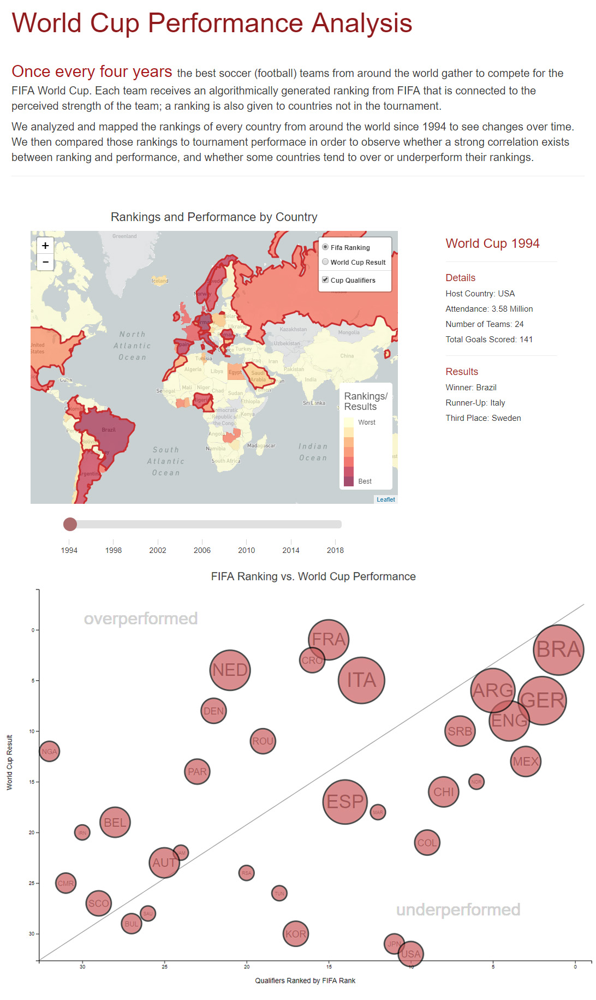

# World-Cup-Analysis
### Looking for Relationship Between FIFA Rankings and Actual World Cup Performance - 1994-2018

Once every four years the best soccer (football) teams from around the world gather to compete for the FIFA 
World Cup. Each team receives an algorithmically generated ranking from FIFA that is connected to the perceived strength of the team; a ranking is
also given to countries not in the tournament.

We analyzed and mapped the rankings of every country from around the world since 1994 to see changes over time. We then compared those rankings to 
tournament performace in order to observe whether a strong correlation exists between ranking and performance, and whether some countries tend to over 
or underperform their rankings.

## Final Web Page

